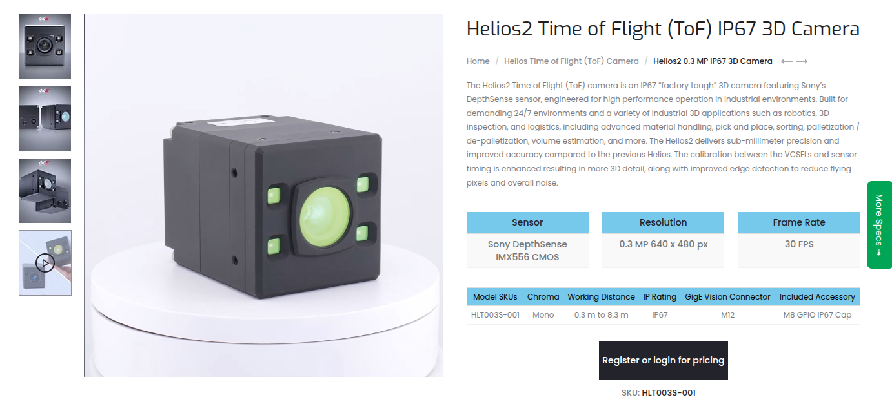
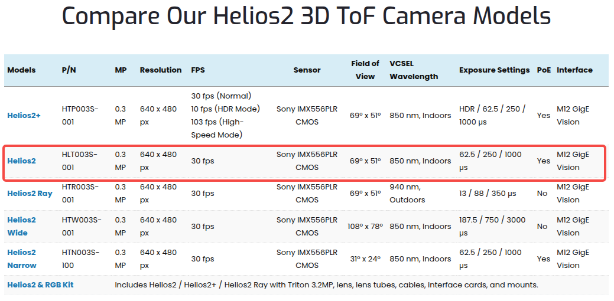
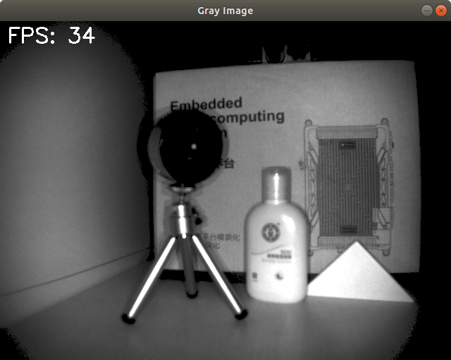
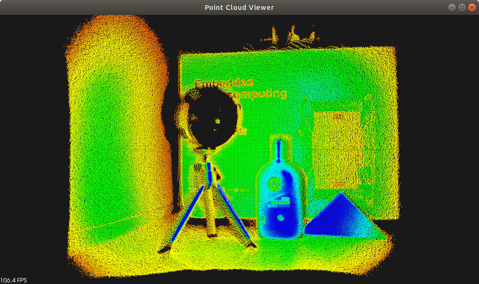

# Lucid 3D ToF 相机数据处理与可视化

本程序展示了使用 Arena SDK、OpenCV 和 PCL 进行 Lucid 3D 相机[Helios2 ToF系列]数据采集、处理和可视化的过程。它从相机捕获 3D 点云数据和强度信息，生成点云和灰度图像，并实时显示两者，同时在灰度图像上叠加帧率（FPS）信息

- 基本介绍

图片来源：https://thinklucid.com/product/helios2-time-of-flight-imx556/
- 基本参数

图片来源：https://thinklucid.com/helios-time-of-flight-tof-camera
- 实际拍摄效果

| 图像                           | 点云                       |
| ------------------------------ | -------------------------- |
|  |  |

- Arena SDK
  - x64 Ubuntu 22.04/24.04: https://dce9ugryut4ao.cloudfront.net/ArenaSDK_v0.1.104_Linux_x64.tar.gz
  - x64 Ubuntu 18.04: https://dce9ugryut4ao.cloudfront.net/ArenaSDK_v0.1.68_Linux_x64.tar.gz

## 执行流程

程序按照以下步骤采集、处理和可视化相机数据：

1. **设置采集模式**：
    - 将相机配置为“连续”模式，以实现不间断的数据流
    - 设置采集帧率（例如 30 FPS），确保帧捕获一致性

2. **设置缓冲区处理模式**：
    - 将流缓冲区处理模式设置为“仅最新”（NewestOnly），优先处理最新帧，丢弃旧帧以避免缓冲区溢出

3. **启用自动协商数据包大小**：
    - 激活自动协商数据包大小功能，优化相机与主机之间的数据传输效率

4. **启用数据包重发**：
    - 启用数据包重发机制，恢复丢失的数据包，确保数据传输的可靠性

5. **启动数据流**：
    - 启动相机的数据流，开始捕获包含 3D 坐标（X、Y、Z）和强度数据的帧

6. **获取图像**：
    - 以指定超时时间（例如 2000 毫秒）连续获取图像帧
    - 跳过不完整的帧，确保数据完整性

7. **处理和可视化数据**：
    - **灰度图像生成**：从每帧中提取强度数据，使用 OpenCV（`cv::Mat`）构建单通道 8 位灰度图像
    - **点云生成**：将 3D 坐标（X、Y、Z）和强度数据转换为 PCL 点云（`pcl::PointCloud<pcl::PointXYZI>`）
    - **帧率计算**：根据连续帧之间的时间间隔计算 FPS，使用指数平滑以获得稳定的显示值
    - **实时可视化**：使用 `cv::imshow` 和 `cv::putText` 显示带 FPS 的灰度图像，使用 PCL 的 `CloudViewer` 显示点云

8. **重新排队缓冲区**：
    - 将处理后的图像缓冲区重新排队到相机，优化内存使用

9. **停止数据流**：
    - 停止相机数据流，清理资源，包括销毁 OpenCV 窗口

## 附加细节

- **相机配置**：程序在修改相机设置（例如采集模式、像素格式）前备份初始设置，并在执行后恢复
- **像素格式**：使用 `Coord3D_ABCY16` 格式提取 X、Y、Z 坐标和强度（右移 8 位转换为 `uint8_t`）
- **可视化**：灰度图像显示在 OpenCV 窗口（`Gray Image`）中，点云显示在 PCL 窗口（`Point Cloud Viewer`）中。用户可通过按 ESC 键或关闭 PCL 窗口退出
- **FPS 显示**：使用 `std::chrono` 计算 FPS，并在灰度图像上以 `FPS: **` 格式实时显示
- **错误处理**：捕获并报告 Arena SDK 异常、标准 C++ 异常和未知异常，确保程序运行稳健

## 依赖项

- **Arena SDK**：用于相机控制和数据采集
- **OpenCV**：用于灰度图像处理和可视化，编译参考`build_ffmpeg.sh`与`build_opencv.sh`
- **PCL（点云库）**：用于点云生成和可视化，编译参考`build_vtk.sh`与`build_pcl.sh`
- **C++ 标准库**：用于计时（`std::chrono`）和其他操作

## 使用方法

1. 确保相机已连接并与 Arena SDK 兼容
2. 使用正确配置的依赖项（Arena SDK、OpenCV、PCL）编译程序
   ```shell
   mkdir build && cd build
   cmake ..
   make -j4
   ./ArenaCameraTest
   ```
3. 运行可执行文件，程序将：
    - 列出检测到的相机设备及其详细信息
    - 开始捕获和处理 3D 数据
    - 在两个窗口中分别显示灰度图像（含 FPS）和点云
4. 按 ESC 键或关闭 PCL 窗口以停止程序
5. 查看控制台输出的执行时间和状态信息

---

# Lucid 3D ToF Camera Data Processing and Visualization (English)

This program demonstrates the acquisition, processing, and visualization of 3D camera [Helios2 ToF serial] data using the Arena SDK, OpenCV, and PCL. It captures 3D point cloud data and intensity information from a camera, generates a point cloud and a grayscale image, and displays both in real-time with the frame rate (FPS) overlaid on the grayscale image.

- basic information
  
  picture is from: https://thinklucid.com/product/helios2-time-of-flight-imx556/
- basic parameter
  
  picture is from: https://thinklucid.com/helios-time-of-flight-tof-camera
- capture result

| picture                        | pointcloud                 |
| ------------------------------ | -------------------------- |
|  |  |

- Arena SDK
  - x64 Ubuntu 22.04/24.04: https://dce9ugryut4ao.cloudfront.net/ArenaSDK_v0.1.104_Linux_x64.tar.gz
  - x64 Ubuntu 18.04: https://dce9ugryut4ao.cloudfront.net/ArenaSDK_v0.1.68_Linux_x64.tar.gz

## Execution Workflow

The program follows these steps to acquire, process, and visualize camera data:

1. **Set Acquisition Mode**:
    - Configures the camera to operate in "Continuous" mode for uninterrupted data streaming.
    - Ensures consistent frame capture by setting the acquisition frame rate (e.g., 30 FPS).

2. **Set Buffer Handling Mode**:
    - Configures the stream buffer handling mode to "NewestOnly" to prioritize the latest frames, discarding older ones if the buffer is full.

3. **Enable Auto-Negotiate Packet Size**:
    - Activates automatic negotiation of packet size to optimize data transfer efficiency between the camera and the host.

4. **Enable Packet Resend**:
    - Enables packet resend to recover lost data packets, ensuring reliable data transmission.

5. **Start Stream**:
    - Initiates the camera's data stream to begin capturing frames containing 3D coordinates (X, Y, Z) and intensity data.

6. **Acquire Images**:
    - Continuously retrieves image frames from the camera with a timeout (e.g., 2000 ms).
    - Skips incomplete frames to ensure data integrity.

7. **Process and Visualize Data**:
    - **Grayscale Image Generation**: Extracts intensity data from each frame and constructs a single-channel 8-bit grayscale image using OpenCV (`cv::Mat`).
    - **Point Cloud Generation**: Converts 3D coordinates (X, Y, Z) and intensity into a PCL point cloud (`pcl::PointCloud<pcl::PointXYZI>`).
    - **Frame Rate Calculation**: Computes the FPS based on the time interval between consecutive frames, applying exponential smoothing for stable display.
    - **Real-Time Visualization**: Displays the grayscale image with FPS overlaid (using `cv::imshow` and `cv::putText`) and the point cloud (using PCL's `CloudViewer`).

8. **Requeue Buffer**:
    - Returns processed image buffers to the camera's queue for reuse, optimizing memory usage.

9. **Stop Stream**:
    - Stops the camera's data stream and cleans up resources, including destroying the OpenCV window.

## Additional Details

- **Camera Configuration**: The program backs up the camera's initial settings (e.g., acquisition mode, pixel format) before modifying them and restores them after execution.
- **Pixel Format**: Uses `Coord3D_ABCY16` for 3D data, extracting X, Y, Z coordinates and intensity (shifted 8 bits to `uint8_t`).
- **Visualization**: The grayscale image is shown in an OpenCV window (`Gray Image`), and the point cloud is displayed in a PCL viewer (`Point Cloud Viewer`). Users can exit by pressing the ESC key or closing the PCL viewer.
- **FPS Display**: The FPS is calculated using `std::chrono` and displayed on the grayscale image in the format `FPS: **`, updated in real-time.
- **Error Handling**: Catches and reports exceptions from Arena SDK, standard C++ exceptions, and unexpected errors, ensuring robust operation.

## Dependencies

- **Arena SDK**: For camera control and data acquisition.
- **OpenCV**: For grayscale image processing and visualization.
- **PCL (Point Cloud Library)**: For point cloud generation and visualization.
- **C++ Standard Library**: For timing (`std::chrono`) and general operations.

## Usage

1. Ensure the camera is connected and compatible with the Arena SDK.
2. Compile the program with properly configured dependencies (Arena SDK, OpenCV, PCL).
   ```shell
   mkdir build && cd build
   cmake ..
   make -j4
   ./ArenaCameraTest
   ```
3. Run the executable. The program will:
    - List detected camera devices and their details.
    - Start capturing and processing 3D data.
    - Display the grayscale image with FPS and the point cloud in separate windows.
4. Press the ESC key or close the PCL viewer to stop the program.
5. Check the console for execution time and status messages.